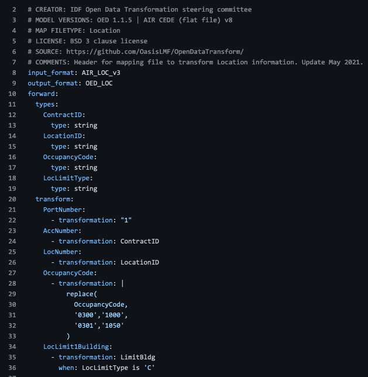

Inputs
=========

This section describes the input files you will need to run a transformation.

Configuration File
--------------------

The config file defines the filepath and filename for input files, output files, mapping files and data validation files. 

It defines the choice of loader, extractor and runner. 
The config file is written in .yaml format.
One configuration file is required for each transformation: one per account, location, and reinsurance file.
`Example here <https://github.com/OasisLMF/OEDtransform/tree/master/examples/cede_test>`_ and shown below:

.. image:: ../../docs_img/example_config.png
  :width: 600
  :alt: An example config file

The fields `mapping: input_format` and `mapping: output_format` are used to identify which mapping is used in the transformation. The field value must match the value given for `input_format` and `output_format` in the mapping files.

A config file can be used in command line execution, or loaded into the user interface.
Alternatively the information can be prepared in the user interface and saved to a text file. 

Input data
--------------------

Flat file input (.csv) or SQL database describing account, location, and reinsurance data.

An example input location file with accompanying config and mapping file is available `here <https://github.com/OasisLMF/OpenDataTransform/blob/master/examples/cede/archive/cede_test_v2/>`_. 

Mapping files
--------------------

A mapping file describes the conversion between two data formats. They are written as a .yaml text file.

A mapping file can be used to define a forward transformation (e.g., Model A to B) and a reverse transformation (Model B to A).

Multiple mapping files can be used together to define a mapping between a source and destination format that do not appear in the same mapping file. I.e., A mapping file for model A to B and and a mapping file for Model B to C, can be used to transform data directly from A to C. 

The mapping file header describes the mapping version, the source and destination formats (and their versions), and information about when and who created the mapping. 

The mapping file defines the source field data types and the transformations to be performed. Transformations can copy one field into another, substitute field values using a *replace* function, or include conditional transformation using a *where* clause, as in the example below.

**Mapping file templates** are available in the GitHub project: CEDE to OED conversion for `account files <https://github.com/OasisLMF/OpenDataTransform/blob/master/examples/cede_test_v3/AIR-OED-ACC_v3.yml>`_ and `location files <https://github.com/OasisLMF/OpenDataTransform/blob/master/examples/cede_test_v3/AIR-OED-LOC_v3.yml>`_.

These act as 'default' mappings for direct use in the current form, or as a base from which to create new mappings. By copying and editing these, a user can tailor the mapping for a specific case (a portfolio or user may require a specific match-up of occupancy code in the source and destination formats, which is not used in the default file). 
The templates can be updated to reflect changes in model formats as they are updated by model vendors.

.. toctree::
   :maxdepth: 1

   mapping-files.rst
   transformer-language.rst

Data validation definition
----------------------------

One validation definition file is required for each input file. These .yaml files describe the data validation fields and values that will be checked before and after the transformation. 
Validation can be defined to report (for example) sum, max, min or average values by user-defined groupings - e.g., sum of building TIV per occupancy and peril.

* `Example of validation without grouping <https://github.com/OasisLMF/OpenDataTransform/tree/master/examples/demonstration/validation>`_
* `Example of validation with grouping <https://github.com/OasisLMF/OpenDataTransform/tree/master/examples/demonstration/validation-groups>`_

Portfolio metadata
--------------------------
Portfolio metadata is optional information that provides a high-level context about the portfolio being transformed. The metadata includes, for example, the portfolio as-at date, geographic coverage, perils included, and summary of conditions. This is useful for recording the types of portfolio that have been transformed, and has value in understanding what types of data testing has been conducted for, and the success of transformation for different portolio types.

