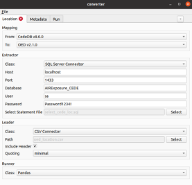

Executing a data transformation
====================================

A data transformation can be executed via the **User Interface** or the **Command Line**. Either method will allow to use flat file input data, or a database connection. 

Either method will allow transformation of flat file data, or via SQL database connection.

Running ODTF via User Interface
---------------------------------

The user interface is accessed by running a `Windows-compatible executable file <https://github.com/OasisLMF/OpenDataTransform/tree/develop/apps>`_.

A user can load a configuration .yaml file, which will populate the fields in the UI. 

Alternatively, you can configure the transformation entirely in the UI. These settings can be saved to a text config file for reference.

Enter on the `Location`, `Account`, and `Reinsurance` tabs:
* Mapping: the source and destination mapping
* Extractor: source data path or database connection 
* Loader: destination data path or database connection 
* Runner: pandas is used as the default

Enter portfolio metadata on the `Metadata` tab, and execute the transformation on the `Run` tab.

Template config, mapping and validation files are not provided in the executable package, and should be downloaded from GitHub and saved on your local machine.

Running ODTF via Command Line
---------------------------------

Running via the command line interface requires installation of the converter package from GitHub:

Pre-requisites:

To use the ODTF you will require:

* `Python <https://www.python.org/>`_ version 3.8 or higher. To install Python, follow instructions at the `Python For Beginners <https://www.python.org/about/gettingstarted/>`_ page.

* To install the package via command line, you will require: the package `pip <https://pypi.org/project/pip/>`_.

It is recommended to install the package in a clean virtual environment.

Download and install:

The tool operates on a local installation only.

To install the package via command line (Mac OS, Linux, Windows):

1. Download the Python package from the project GitHub pages at `github.com/OasisLMF/OpenDataTransform <https://github.com/OasisLMF/OpenDataTransform/>`_. 

2. Install the Python package using ``pip install git+https://github.com/OasisLMF/OpenDataTransform.git``

The most basic command to run a transformation is ``converter -c <path to config file> run``.

Command line usage::

    Usage: converter [OPTIONS] COMMAND [ARGS]...

      Initialises the cli grouping with default options.

    Options:
      -o, --option TEXT...  Sets a configuration option, a path and value are
                            required eg -o extractor.options.foo.bar bash

      -c, --config TEXT     Path to the configuration file.
      -v, --verbose         Specifies the verbosity level, if used multiple times
                            the verbosity is increased further

      --no-color            Disables colorised output.
      --help                Show this message and exit.

    Commands:
      run          Runs the data conversion
      show-config  Prints the resolved config to the console

.. toctree::
   :maxdepth: 2
   :caption: Further information on configuration and command line use:

   ../developer/config/index.rst
   ../developer/cli/index.rst

