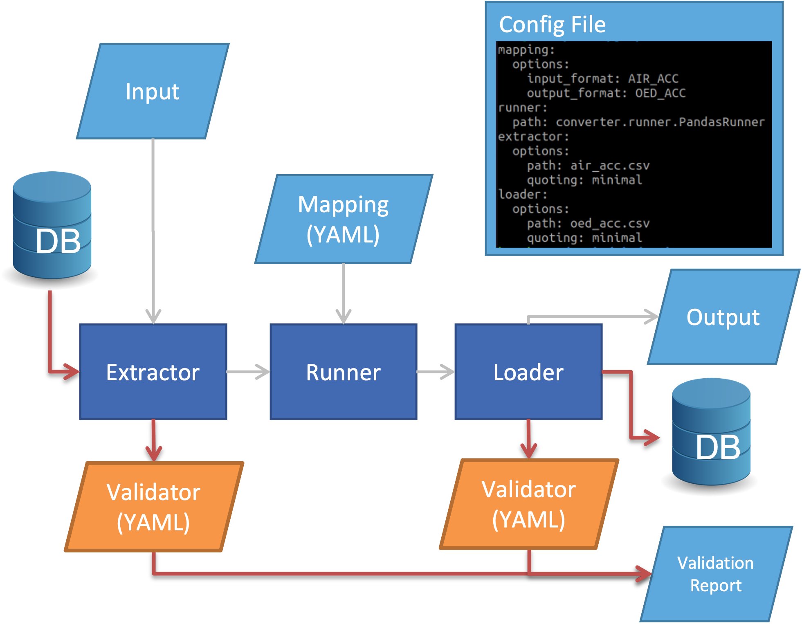

Framework Structure
======================

The Open Data Transformation Framework structure is shown below

An *extractor* module reads the *input* data. Extractors are available to read flat files (e.g., .csv) and from SQL databases. New extractors can be developed to read other data types.

A *runner* perform the transformation, using the *mapping* file as a reference. Runners can use various packages. The framework currently provides runners using pandas, MODIN, and DASK. Performance (i.e., speed) of transformation can very between each program.

A *loader* writes the *output* data in the defined format and location. Loaders are available to write to flat files and to SQL databases. New loaders can be developed to write other data types.

A *configuration file* is used to define the extractor, loader and runner, as well as file paths of input and output data, the mapping file, the data validation file, and log file. 

*Validator files* are used to summarise the data being processed by the extractor and loader, to check the data before and after transformation. This summary is written to a *validation report*. 

